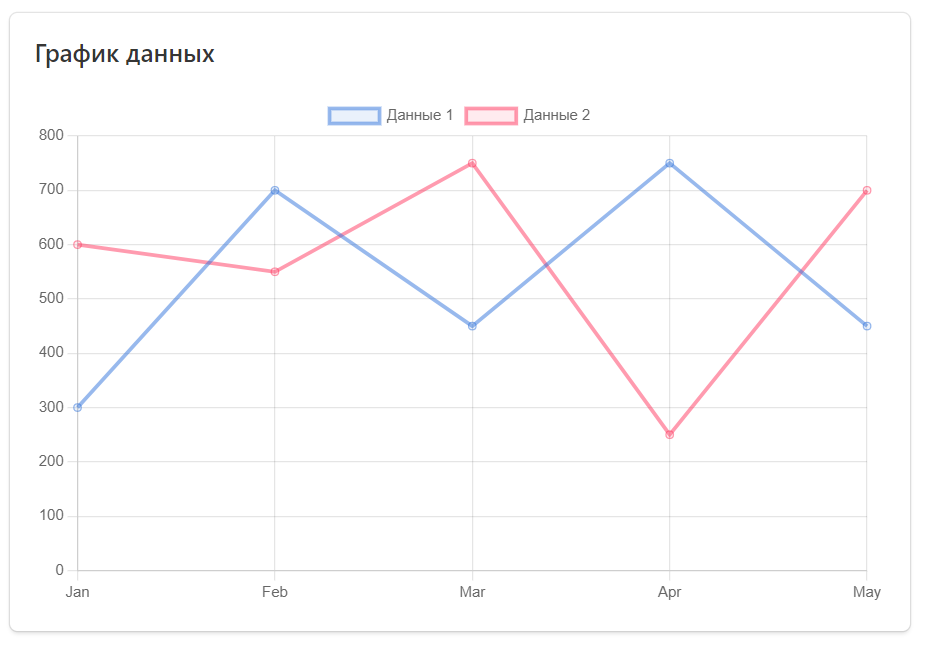

# Компонент для отображения линейных диаграмм на Vue

Компонент для отображения линейных диаграмм для приложения Vue.js, работающий на базе библиотеки Chart.js



## Требования

Для запуска этого примера требуется следующий элемент:

* [Node.js](https://nodejs.org/)

## Установка

### 1. Клонировать репозиторий

Чтобы клонировать этот репозиторий, выполните на своем терминале следующую команду:

```bash
git clone https://github.com/Nikonoffcmi/Web-rgr.git
```

### 2. Установите зависимости

В каталоге проекта выполните следующие команды, чтобы установить все необходимые зависимости:

Перейдите в каталог проекта
```bash
cd Web-rgr
```
Установите все зависимости
```bash
npm install
```

### 3. Запустите приложение

Чтобы запустить приложение, выполните следующую команду:

```bash
npm run serve
```

Приведенная выше команда запустит сервер разработки. Откройте браузер и перейдите к приложению по адресу [localhost:8080](http://localhost:8080).

### 4. Сборка

Чтобы собрать приложение, выполните следующую команду:

```bash
npm run build
```

Оптимизированные файлы сборки будут доступны в каталоге dist.